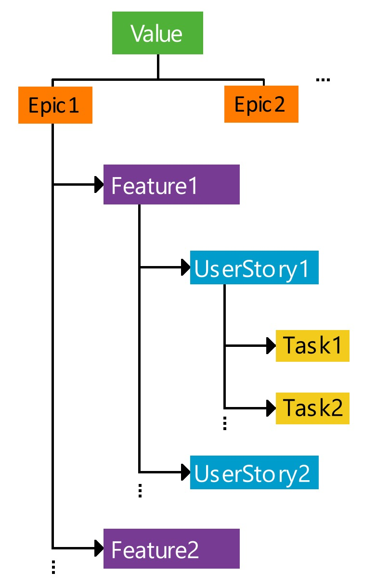

## GitHub Issue Templates and Workflow ##

This sample repository provides the GitHub issue templates and workflow that each team must use.
Required Setup
Copy the entire `.github` folder, including the `ISSUE_TEMPLATE` and `workflows` subfolders, into your team repository.
The folder must have the following structure:

```text
.github/
├── ISSUE_TEMPLATE/
│   ├── value.yml
│   ├── epic.yml
│   ├── feature.yml
│   ├── user-story.yml
│   └── task.yml
└── workflows/
    └── enforce-user-story-completion.yml
```
Templates are provided for all issue types. Select the appropriate template and complete all required fields when creating an issue.

- Link each child issue to its immediate parent. For example:
   - Add each User Story as a sub-issue of the relevant Feature.
   - Add each development Task as a sub-issue of the relevant User Story, using the Task issue type.

The **ISSUE_TEMPLATE** folder contains forms for creating the following GitHub issue types:
- Value
- Epic
- Feature
- User Story
- Task

When creating an issue, select the appropriate template and complete all required fields. The template will automatically provide the required issue structure and prompts.

The workflows folder contains an automated check for User Stories. If a User Story is closed before all Acceptance Criteria and Completion and Verification Criteria are checked, the workflow will automatically reopen it and add an explanatory comment.

## Required Issue Hierarchy ##

Teams must organize and link issues using the following hierarchy:



Follow these rules:

- Link each stakeholder Value issue to the relevant Epic or Epics 
- Add each Feature as a sub-issue of its immediate parent Epic.
- Add each User Story as a sub-issue of its immediate parent Feature.
- Add each Task as a sub-issue of its immediate parent User Story. A Task may be linked directly to a Feature or Epic only when no appropriate User Story exists.
- Link related issues, pull requests, commits, tests, designs, stakeholder evidence, and other supporting records where applicable.
- Update issues throughout the project as contributions, decisions, verification, and outcomes change.

**Connecting an Existing Child Issue**

If the child issue has already been created using a template:
- Open its immediate parent issue.
- Find the Sub-issues section.
- Click the small ▼ arrow beside Create sub-issue.
- Select Add existing issue.
- Search for and select the existing child issue.

